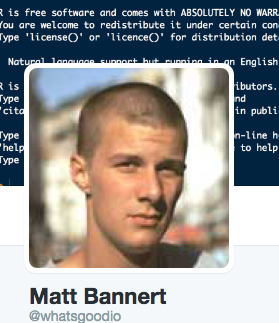
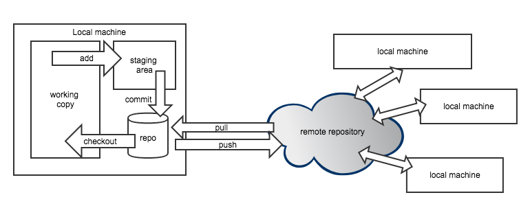
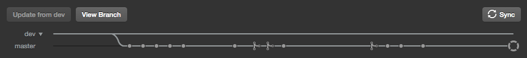

```{r setup, include=FALSE}
knitr::opts_chunk$set(echo = FALSE)
```

## Preview

1. edit a textfile
2. git add
3. git commit
4. git push
5. look at github
6. find commit by collaborator


## :~$ whoami

**Matthias Bannert**

- economics master, PhD from ETHZ, mostly methodology and stats
- currently: develops software for academic researchers @ETHZ
- open source software projects: tstools, kofdata, timeseriesdb, RAdwords
- git user since 2009
- ~50 git repos @KOF
-  @whatsgoodio

<div align="right">
</div>

## Git Gut Check

```{r,echo=FALSE}
library(grid)
library(shiny)
source("bullet.R")

fluidPage(sidebarLayout(sidebarPanel(
  numericInput("members", "Number of participants", 20),
  numericInput("rstats", "R Statistical langauge", 10),  
  numericInput("passive", "passive git", 10),
  numericInput("active", "active git", 10)
  ),
  mainPanel(
    renderPlot({
      techavg <- mean(c(input$rstats,
                        input$passive,
                        input$active) / input$members)*100
  df1 <- data.frame(units = c("R(%)","p. git(%)","act. git(%)"),
                    low = c(25,25,25),
                    mean = c(50,50,50),
                    high = c(100,100,100),
                    target = c(techavg,techavg,techavg),
                    value = c(100*(input$rstats/input$members),
                              100*(input$passive/input$members),
                              100*(input$active/input$members)
                              )
                    )

  g <- gridBulletGraphH(df1,bcol = c("#999999","#CCCCCC","#E1E1E1"),
                   vcol = "#333333",font = 20)

  g + title(paste("Usage of Technologies Among Participants", sep=" "))

})  


    )
  ))

```

## Git Breakdown

- git is a version control system (for text files).
- git is decentralized.
- git is NOT github.

## Git +/- (vs no version control)

- (-) learning curve / overhead
- (-) not for binaries
- (+) industry standard (easy to onboard people)
- (+) semantic commits foster real versions
- (+) head is clear (which version counts)
- (+) professional collaboration workflow
- (+) distributed backup

## Git is decentralized



## A few words on Github

- github <3 remote git provider of most
- cool features:
    - issue tracker /w close commit
    - renders markdown
    - [renders geojson](https://github.com/mbannert/maps) 
    - project management
    - wiki
    
  - alternatives: bitbucket, gitlab
  - GUIs: Github Desktop, Source Tree, Tortoise

## Excursion: Log in like a developer


  - key pair: public and private key
  - share public key with the party you want to access
  - never share private key
  - private key can be password protected
  
  => step-by-step guide: [how to create SSH Keys](https://help.github.com/enterprise/2.12/user/articles/generating-a-new-ssh-key-and-adding-it-to-the-ssh-agent/)


# Let the games begin!

## Teams

- team *ten*
- team *jacks*
- team *queens*
- team *kings*
- team *aces*

spades are group admins. 


## Git Gut Check Pt. II

- git clone
- git init
- git remote -v
- git add, git commit, git push 
- git pull origin
- git status
- git log
- git diff
- git fetch
- git branch
- git checkout
- (git bisect)


## Task 1: setup a repository

- admins: goto github and create a git repository
- admins: add your collaborators
- everybody: think of a good place on your hard disk to store multiple git projects
- everybody: get URL from github and clone repo

## Task 2: get an update

- admins: create a text file with minimal content
- admins: add, commit and push the file
- team members: get the latest update from the remote repository

helpul commands: git status, git remote -v

## Task 4: The first conflict

- everybody: create a file called your_name.md
- add some text to the file
- commit the file and add it to your teams repository
- does it work? What happens? 

## Task 5: conflicts that need manual intervention

- pick two team members.
- first member: create a file named *team.md*
- enter text to the first three lines
- add, commit, push it to the remote repo
- second member: create a file named *team.md*
- edit the first two lines.
- add, commit, push it to the remote repo

- What happens? What does git do to help you fix this?

## Task 3: Undo

- revert changes to single file
- revert commit

## Professional development workflow /w git



- **production** code on **master** branch
- **development** code on **dev** branch
- **feature specific** code on **feature-xyz** branch
- use **pull requests** and **revision requests** to get features to **dev**
- use **pull requests** and **revision requests** to get dev merged on **master**

hint: git log --graph --pretty=oneline

## Task 5: create a feature branch to tackle an issue

- admin: raise an issue using the issue tracker
- make sure you're up to date before working on the feature
- switch branches by checking out the new feature-branch
- add branches to the remote search path
- use the Github GUI to issue a PR

## Task 6 merge a pull request

- team admin: approve review 
- merge pull request into another branch using github

hint: use a commit message that refers to the issue by its number, like
**closes #2**. 

## Forks vs branch PR

- fork: work with different remote repositories
- branch: same remote repository
- use cases: 
    - fork used with different, mostly external owners 
    - branch PR: collaborator in the team
    - fork PR: (from user to contributor)
    
## Summary


## Resources 

- [official git website](https://git-scm.com/)
- [this presentation](https://github.com/mbannert/git-for-researchers)
- [Eric Sink's version control by example](http://ericsink.com/vcbe/vcbe_a4_lo.pdf)
- [Github's introduction to SSH Keys](https://help.github.com/enterprise/2.12/user/articles/generating-a-new-ssh-key-and-adding-it-to-the-ssh-agent/)
- [Atlassian's tutorial (creater of bitbucket)](https://www.atlassian.com/git)
- [github hello word tutorial](https://guides.github.com/activities/hello-world/)


