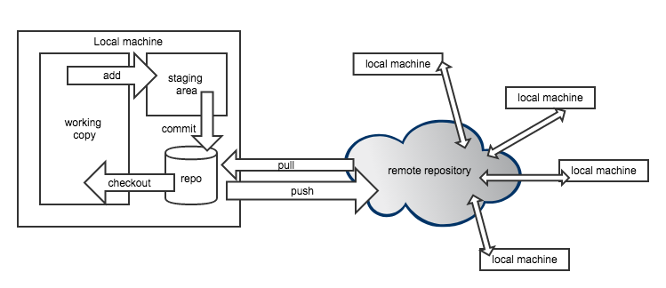

```{r setup, include=FALSE}
knitr::opts_chunk$set(echo = FALSE)
```

## Preview

1. edit a textfile
2. git add
3. git commit
4. git push
5. look at github
6. find commit by collaborator


## :~$ whoami

**Matthias Bannert**

- economics master, PhD from ETHZ, mostly methodology and stats
- currently: develops software for academic researchers @ETHZ
- open source software projects: timeseriesdb, dropR, RAdwords
- git user since 2009
- ~50 git repos @KOF
-  @whatsgoodio

<div align="right">
</div>

## Git Gut Check

- use R
- passively use git
- actively use git

## Git Breakdown

- git is a version control system (for text files).
- git is decentralized.
- git is NOT github.

## Git is decentralized



## A few words on Github

- github <3 remote git provider of most, but see also
    - bitbucket
    - gitlab
- cool features
    - issue tracker /w close commit
    - renders markdown
    - [renders geojson](https://github.com/mbannert/maps) 
    - project management
    - wiki

## A word on SSH Keys

## Git +/-


## Resources 
- version control by example (eric sink)


